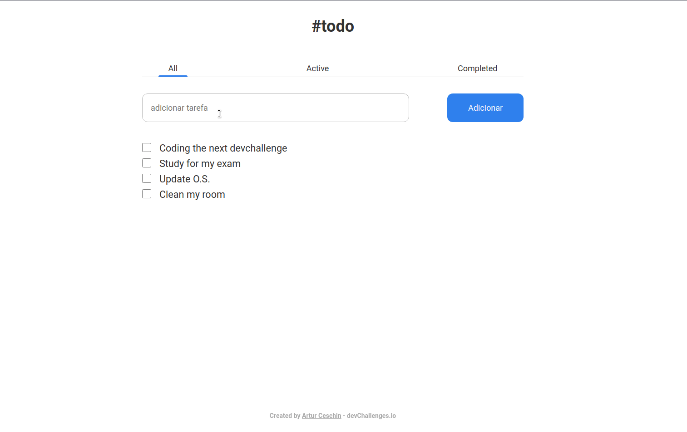

<h1 align="center">
  
</h1>



<h1 align="center">
    ig.news - Next.js
</h1>
<p align="center">Project create through the devchallenge.io [devchallenge.io](https://devchallenges.io/challenges/hH6PbOHBdPm6otzw2De5) Challenges 🚀</p>

## About this project

## This project is a simple todo list tasks, made with Next and Typescript

## Technologies 👩‍💻

Thecnologies used in this project

- [ReactJS](https://reactjs.org/)
- [NextJS](https://nextjs.org/)
- [TypeScript](https://www.typescriptlang.org/)
- [SASS](https://sass-lang.com/)

---

## Requirements

It is necessary to have installed on your machine

- [Git](https://git-scm.com/)
- [Yarn](https://classic.yarnpkg.com)

## Starting 🚀

```bash
# Clone this project
$ git clone https://github.com/Artur-Ceschin/ignews.git

# Access
$ cd ignews

# Install dependencies
$ yarn

# Run the project
$ yarn dev

# The server will initialize in the <http://localhost:3000>
```

---

## License📃

This project is under license from MIT. For more details, see the [LICENSE](./LICENSE.md) file.

### Author

---

Made with ❤️ by Artur Ceschin 👋🏻 Please fell free to contact me!
<br/>
[](https://www.linkedin.com/in/artur-peres-ceschin-programador/)
[](mailto:artur.ceschin@gmail.com)
